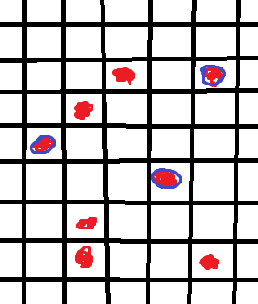
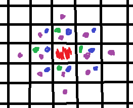
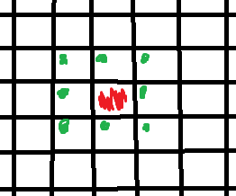
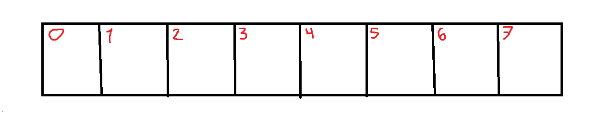
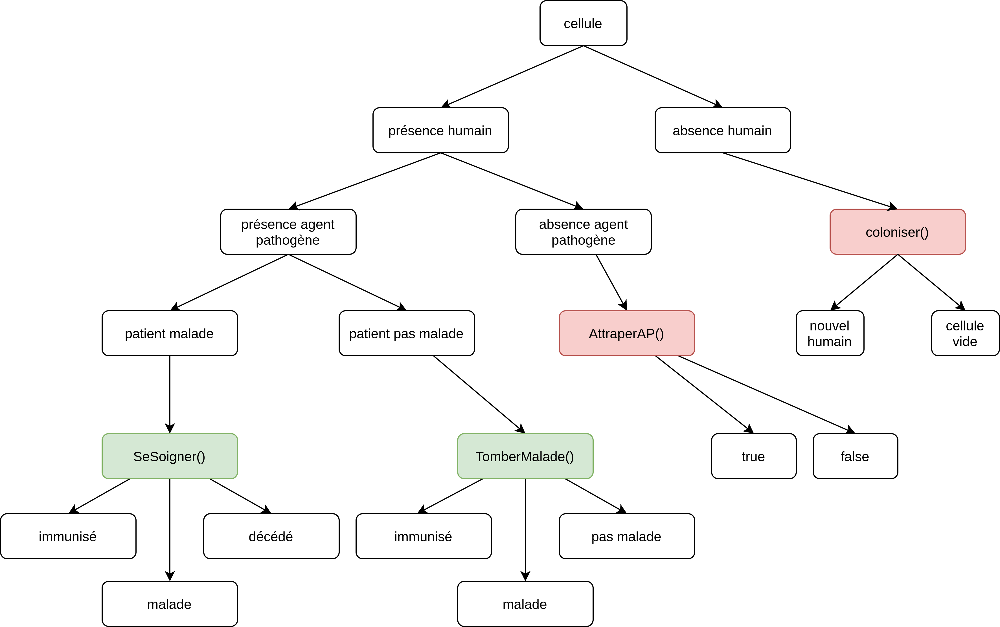
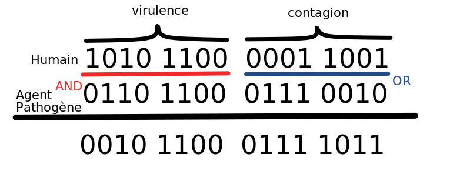

# Diversité (08.03.2021)

### Modèle

#### Automate cellulaire



- Matrice carrée $100 \times 100$ par exemple
- Disposer aléatoirement les **humains (rouge)** 
- Disposer aléatoirement les **pathogènes (bleu)** parmi les humains

#### Acteurs 

##### Humains

- Seul acteur représenté dans l'automate cellulaire

##### Agent pathogène

- Virus ou bactérie causant la maladie

#### Facteurs

##### Génome

- Code génétique assigné aux acteurs (humains et pathogènes)
- Représentation sur $2$ octet ?

##### Virulence

- Taux de létalité sous forme d'un facteur, haut facteur $\implies$ haut risque de décès

##### Contagion

- Facteur déterminant la probabilité de contaminer les voisins

##### Mutations humaine

- Développement de résistance des humains ?
- Idée :
  - Les génomes résistant au pathogène ont plus de chance de se multiplier que les autres

##### Mutations pathogènes

- Mutation rapide
- Chaque hôte a une certaine probabilité de faire muter le pathogène et qu'il devienne plus virulent ou contagieux
  - En fonction du génome, attribuer un probabilité de faire muter le pathogène ?

##### Diversité

- Se fait initialement au début de la simulation
  - Facteur de similitude des génomes humains (lors de la génération des premiers individu)
  - Attribuer des génomes différents à chaque individu (plus ou moins différents)

##### Densité de la population (mesures sanitaires)

- Facteur déterminant la densité d'une population et donc de la proximité des individus 
- Grande proximité $\implies$ grand risque de contagion
- Permet de faire la différence entre les mégalopoles très denses et des petites villes
- Joindre densité et mesures sanitaires ?
  - Par simplification : Mesures sanitaires $\implies$ baisse artificielle de la densité
  - Et inversement : Aucune mesures sanitaire $\implies$ augmentation de la densité 

##### Age

- Compter le nombre d'itérations depuis de création de la cellule
- Facteur de résistance aux pathogènes

##### Conditions de vie

- Facteur de résistance **globale** d'une population (accès au soin, famines, obésité)
- Facteur aggravant ou pas

#### Voisinage (deux méthodes)

1. **Voisinage non fixe** dépendant de la densité de la population

   

   densité faible (vert)

   densité moyenne (bleu)

   densité forte (violet)

2. **Voisinage fixe** 

   

   La densité est un facteur augmentant la contagion

#### Cellules

##### Informations des cellules

Chaque cellule contient des informations sur l'individu et le pathogène si présent

###### Humain

- Génome : invariant ? appartenance à un groupe, un population
- âge : facteur modifiant la létalité du pathogène
- conditions de vie : facteur modifiant la létalité du pathogène

###### Agent pathogène

- Génome : détermine sa virulence, contagion, mutation

##### État des cellules

###### Humain

- sain : pas porteur du pathogène
- contagieux : porteur du pathogène
- malade : porteur du pathogène + maladie
- immunise : résistant au pathogène
- décès : la cellule redevient vide

###### Agent pathogène

- présent : hôte contaminé
- absent : pas de pathogène

#### Paramètres de l'automate

- taille de l'automate, matrice carrée
- pourcentage d'humain initialement déposé dans la grille ?
- pourcentage d'humain initialement contaminés
- densité de la population
- diversité des génomes humains
- génome initial du pathogène définissant se virulence et contagion
- vitesse de mutations du pathogène
- condition de vie de la population
- facteur de reproduction de la population (coloniser d'autres cases)

#### Initialisation

- Créer un tableau bidimensionnel d'une taille fixe
- Disposer les humains vers le centre (éviter que les bord influence les comportements)
- Chaque humain a des attributs, dont des communs au sein d'une population
- Disposer le/les ? agents pathogènes (identiques) parmi les humains
- Chaque agent pathogène a des attributs (génome) $\implies$ traduit sa virulence et contagion

#### Fonctionnement global de l'automate

- Processus itératif simulant l'écoulement du temps
- Parcourt du domaine par une double boucle **for** (i,j)
- Éventuellement définir les cases sur les bords comme "neutres", restant vide
- Une itération ~= $10$ jours ?

### Implémentation

#### Informations

Comment représenter l'information contenue dans une cellule ?

##### Codage

Représenter les informations et les états sous forme de **chaîne de caractères**

###### Représentation des états

Octet $1$ :



- Indice $0$ : 
  - $1$ = présence d'un humain
  - $0$ = absence d'un humain
- Indice $1$ :
  - $1$ = présence d'un agent pathogène
  - $0$ = absence d'un agent pathogène
- Indice $2$ :
  - $1$ = malade
  - $0$ = sain
- Indice $3$ :
  - $1$ = contagieux
  - $0$ = non contagieux
- Indice $4$ : 
  - $1$ = immunisé
  - $0$ = non immunisé
- Indices $5$ à $7$ :
  - $00$ = niveau de vie très bas (famine, aucun accès au soin, etc...)
  - $01$ = niveau faible (pauvreté)
  - $10$ = niveau de vie moyen
  - $11$ = haut niveau de vie (bon soins et santé générale) 

###### Représentation des informations

Octet $2$ et $3$ :


- Génome, $65536$ génomes différents

Octet $4$ et $5$ :


- Représentation de l'âge sur deux octets : $2^{16} = 65536$ **jours** ~= 180 ans
- Une itération équivaut à un jour

Octet $6$ :


- Compteur de jours après l'infection permettant de déterminer la durée de l'immunité ?
- $256$ jours maximum, suffisant pour l'immunité

Octet $7$ et $8$ :


- Génome de l'agent pathogène si présent
- $0000000000000000$ si l'hôte n'est pas contaminé
- $\implies$ $65536$ génomes de pathogènes différents

#### Interactions

La tête de lecture parcourt les éléments en couvrant le domaine ligne après ligne

1. Pour l'élément $Grid[i][j]$ :
   1. Store les $64$ bits dans une nouvelle variable temporaire
   2. Récupérer les $64$ bits des $8$ voisins et les stocker dans des variables temporaires (utiliser un vecteur de $9$ long long int ?)
   3. **Bitwise operation** les $9$ éléments du vecteur (à détailler)
   4. Ne modifier que les bits de la cellule $Grid[i][j]$
      1. Écrire les cellules mises à jour dans une nouvelle table
      2. Conserver la table de l'itération précédente inchangée jusqu'à ce que la tête ait fini

#### Pseudo code : Grid[i,j], extraction des données

```c++
var0 = 0b111...0; // contenu de Grid[i][j]
var1 = 0b101...0; 
var2 = ...;
...
var8 = ...; // les valeurs des cellules voisines

// Traitement et mise à jour de la cellule Grid[i][j]
if(var0 & (1 << 64)){ // le premier bit de Grid[i][j] est 1 donc il y a un humain sur cette case on peut continuer
    // Récupérer tous les attributs de l'individu
    agentPathogene = (var0 & (1 << 63)) ? true : false: // si il y un pathogène ou non
    malade = (var0 & (1 << 62)) ? true : false:
    contagieux = (var0 & (1 << 61)) ? true : false:
    immunise = (var0 & (1 << 60)) ? true : false:
    niveau_de_vie = (var0 & (11 << 58)) >> 56); // 00, 01, 10, 11
    genome_humain = (var0 & (1111111111111111 << 40)); // génome de l'individu sur deux octets
    age = (var0 & (1111111111111111 << 24)); // âge de l'individu
    tempsImmunite = (var0 & (11111111 << 16)); // temps depuis que l'individu est gueri 
    genome_agent_pathogene = (var0 & 1111111111111111); // génome du pathogène sur deux octets    
}
```

#### Pseudo code : Contaminations des voisins

```c++
if(humain) // un individu se trouve sur la cellule
{
	if(agentPathogene) // l'humain est contaminé, par conséquent il "ignore" ses voisins !
	{
	    // Cette partie de code ne nécessite pas les informations des voisins (individu autonome)
	    // Ne considérer que les paramètres locaux à la cellule
	    if(malade)
	    {
	        SeSoigner();
	    }
        else
        {
            TomberMalade();
        }
	}
    else // aucun pathogène sur cet individu 
    {
        AttraperAP();
    }
}
else // la cellule est vide (colonisation possible)
{
    Coloniser();
}
```

```c++
// fonction déterminant si le patient guérit ou non
// fonction local à la cellule
void SeSoigner(niveau_de_vie, genome_humain, genome_agent_pathogene, age)
{
    Mutations_AP();
}
// fonction déterminant si l'individu va tomber malade durant cette itération 
// fonction local à la cellule
void TomberMalade(niveau_de_vie, genome_humain, genome_agent_pathogene, age)
{
    Mutations_AP();
}
// fonction déterminant si l'individu attrape le pathogène ou non
// fonction globale au système
void AttraperAP()
{
    
}
// fonction déterminant si la cellule vide va accueillir un nouvel individu
// fonction globale au système
void Coloniser(genome_humain)
{
    Mutations_Humaines(genome_humain);
}
// fonction générant des génomes humains à partir d'autres génomes humains
void Mutations_Humaines(genome_humain)
{
    
}
// fonction modifiant les génomes des pathogènes déja présents dans le système !
void Mutations_AP()
{
    
}
```



#### Génomes (match)



- Pour **l'agent pathogène** :
  -  $1111\ 1111\ 1111\ 1111$ : **très** **virulent/contagieux**
  - $0000\ 0000\ 0000\ 0000$ : **peu** **virulent/contagieux**
- Pour **l’être humain** :
  - $0000\ 0000\ 0000\ 0000$ : **très** **résistant**
  - $1111\ 1111\ 1111\ 1111$ : **peu** **résistant**

##### Contagion

- Le pouvoir contagieux du pathogène est **peu sensible** au génome de l'individu
- L'opération **OR** permet de conserver la valeur de contagion du pathogène
- $0111\ 1011_2 = 123_{10}$ : équivaut au niveau de contagion du pathogène sur cet individu
- Le niveau de contagion va de : $0\to 255$, avec $0$ pour pas contagieux et $255$ pour extrêmement contagieux

##### Virulence

- Le pouvoir virulent du pathogène est **sensible** au génome de l'individu
- L'opération **AND** permet d’atténuer la virulence du pathogène en fonction du génome de l'individu
- $0010\ 1100_2=44_{10}$ : équivaut au niveau de virulence du pathogène sur cet individu 
- Le niveau de virulence va de : $0\to 255$, avec $0$ pour pas virulent et $255$ pour extrêmement virulent
