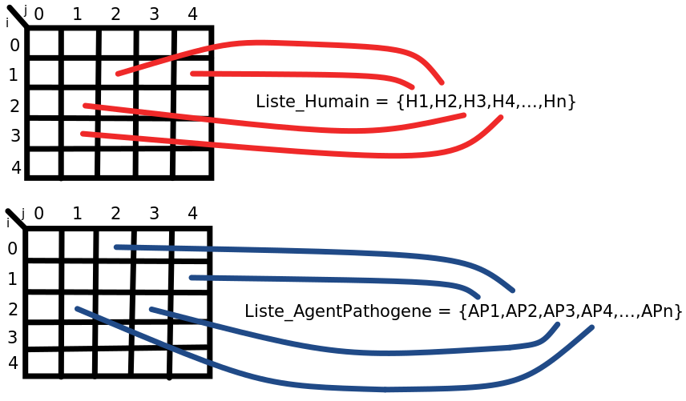
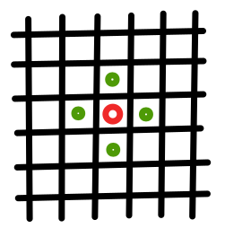
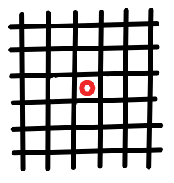

# Diversité (15.03.2021)

### Acteurs

Objets du modèle :

- Humains
- Agents pathogènes

### Facteurs

Attributs des objets :

- Génome humain (immunité)
- Génome agent pathogène (contagion)

### Paramètres du modèle

Paramètres d'initialisation :

- Mutations pathogènes
- Diversité (génomes humains)
- Densité de population

### Automate

- Taille de la grille de pointeurs
  - Une grille de pointeurs pour les humains
  - Une grille de pointeurs pour les agents pathogènes
- Individus sous forme d'objets dans une liste (dimension 1)
- Agents pathogènes sous forme d'objets dans une liste (dimension 1)

##### Initialisation

- Définir le nombre d'individu initialement (densité de population)
- Définir le nombre d'agents pathogènes initialement
- Initialiser les génomes des humains
- Initialiser les génomes des agents pathogènes
- Assigner aux pointeurs les objets

### Cellules

- Représente une **surface** 
- S'attache à un **objet**
- Une cellule est un **pointeur** (observateur d'objets)

### Matrices de pointeurs

1. Une matrice de pointeurs pour les humains : $H[i][j]$
2. Une matrice de pointeurs pour les agents pathogènes : $AP[i][j]$



- Les humains sont sur les cellules : $H[1][2],H[1][4],H[2][1],H[3][1]$
- Les agents pathogènes sont sur les cellules : $AP[0][2],AP[1][4],AP[2][1],AP[2][3]$ 
- $\implies$ $H[1][4]$ est contaminé par le pathogène $AP[1][4]$ et $H[2][1]$ est contaminé par le pathogène $AP[2][1]$  
- $\implies$ $H[1][2],H[3][1]$ sont sains
- $\implies $ $AP[0][2],AP[2][3]$ sont des pathogènes contaminant un espace (surface)

### Voisinage

##### Humain



- Un humain (rouge) ne considère comme voisin que les $4$ cellules avoisinantes directes (vert).
- Ne considère que les humains sur les cases voisines (les objets de la même matrice de pointeurs)

##### Agent Pathogène



- Un agent pathogène ne considère que la case sur laquelle il est. Par conséquent, il ne peut contaminer que un seul humain se trouvant sur la même case.

###### Exemple

A l'itération $k$, le pointeur $AP[i,j]$ pointe sur un pathogène $\implies$ un pathogène se situe sur cette surface.

Le voisinage de $AP[i][j]$ est $H[i][j]$. Si $H[i][j]$ pointe sur un humain, alors cet humain est contaminé.

### Implémentation

##### Listes

- Liste des objets **humains** 
- Liste des objets **agents pathogènes**

##### Matrices de cellules

- Matrice carrée de **pointeurs** pour les humains
  - Un pointeur pointe ou non sur un humain
- Matrice carrée de **pointeurs** pour les agents pathogènes
  - Un pointeur pointe ou non sur un agent pathogène

#### Simulation

1. Initialiser les paramètres de l'automate (densité, diversité, mutations pathogène)

2. Itération pour la mise à jour :

   Parcours linéaire des cellules des matrices

   ```c++
   for(int i=0; i<Grid_Size; i++) // parcourir les lignes
   {
       for(int j=0; j<Grid_Size; j++) // parcourir les colonnes
       {
           // Début du pas
           ...H[i][j]...
           ...AP[i][j]...
           // Fin du pas
       }
   }
   ```

   A chaque pas :

   1. Mise à jour des différents états de la cellule (**Interactions**)
   
3. Itération pour les déplacements :

   Parcours linéaire des cellules des matrices

   ```c++
   for(int i=0; i<Grid_Size; i++) // parcourir les lignes
   {
       for(int j=0; j<Grid_Size; j++) // parcourir les colonnes
       {
           // Début du pas
           ...H[i][j]...
           ...AP[i][j]...
           // Fin du pas
       }
   }
   ```

   Déterminer par une probabilité si les humains de déplacent ou non

   $\implies$ à chaque itération, un certain nombre (pas tous) d'humain du système se déplace
   
   Pour chaque objet sélectionné :
   
   1. Faire bouger l’objet du système (**Mouvements**)

#### Interactions

Interactions à chaque pas de l'algorithme. Phase déterminant les interactions entre les différents objets du système. 

###### Cas 1 :

La cellule ne pointe sur rien, par conséquent aucune modification n'est faite.

```c++
H[i][j] == NULL; // pointeur inactif
AP[i][j] == NULL; // pointeur inactif
```

###### Cas 2 :

La cellule pointe sur un humain mais pas sur un pathogène.

```c++
H[i][j] == objet(humain);
AP[i][j] == NULL;
```

Par conséquent, l'humain n'est pas contaminé mais peut l'être par ses voisins.

Regarder les $4$ voisins directs (on ne considère ici que les **voisins humains**):

```c++
if(H[i][j-1] == objet(humain)) // y a-t-il un humain sur cette cas voisine ?
{
    if(AP[i][j-1] == objet(agentpathogene)) // cet humain est contaminé par un pathogène ?
    {
        // On veut définir si l'humain de la cellule est vulnérable au pathogène 
        // de ce voisin.
        if(Proba_Contamination())
        {
            Genome_Match(objet(humain).genome, objet(agentpathogene).genome);
        }
    }
}
if(H[i][j+1] == objet(humain)) // y a-t-il un humain sur cette cas voisine ?
{
    if(AP[i][j+1] == objet(agentpathogene)) // cet humain est contaminé par un pathogène ?
    {
        // On veut définir si l'humain de la cellule est vulnérable au pathogène 
        // de ce voisin.
        if(Proba_Contamination())
        {
            Genome_Match(objet(humain).genome, objet(agentpathogene).genome);
        }
    }
}
if(H[i-1][j] == objet(humain)) // y a-t-il un humain sur cette cas voisine ?
{
    if(AP[i-1][j] == objet(agentpathogene)) // cet humain est contaminé par un pathogène ?
    {
        // On veut définir si l'humain de la cellule est vulnérable au pathogène 
        // de ce voisin.
        if(Proba_Contamination())
        {
            Genome_Match(objet(humain).genome, objet(agentpathogene).genome);
        }
    }
}
if(H[i+1][j] == objet(humain)) // y a-t-il un humain sur cette cas voisine ?
{
    if(AP[i+1][j] == objet(agentpathogene)) // cet humain est contaminé par un pathogène ?
    {
        // On veut définir si l'humain de la cellule est vulnérable au pathogène 
        // de ce voisin.
        if(Proba_Contamination())
        {
            Genome_Match(objet(humain).genome, objet(agentpathogene).genome);
        }
    }
}
```

###### Cas 3 :

La cellule pointe sur un humain et un pathogène.

```c++
H[i][j] == objet(humain);
AP[i][j] == objet(agentpathogene);
```

Par conséquent, on vérifie si l'humain est vulnérable au pathogène.

```c++
if(Genome_Match(objet(humain),objet(agentpathogene)))
{
    // L'humain garde la pathogène et est donc contaminé
}
else
{
    // L'humain ne garde pas le pathogène et est donc immunisé à ce dernier
}
```

Ceci va déterminer si l'humain garde ou non le pathogène sur la prochaine itération.

###### Cas 4 :

La cellule ne pointe que sur un pathogène, par conséquent le lieu est contaminé.

```c++
H[i][j] == NULL;
AP[i][j] == objet(agentpathogene);
```

Dans ce cas là, il faut déterminer si le pathogène reste en vie ou non.

```c++
if(AP_En_Vie(objet(agentpathoogene)))
{
	// le pathogène va continuer à vivre à l'itération suivante
}
else
{
    // le pathogène meurt à cette itération
    AP[i][j] == NULL;
}
```

#### Mouvements

Après la mise à jour des informations des objets, les humains ont la possibilité de se déplacer. 

Le mouvement est possible si et seulement si le pointeur $H[i][j]$ pointe sur un humain.

Les opérations de déplacements s'effectuent après la mise à jour des attributs d'objets.

La fonction **Deplacer()** détermine si un déplacement est possible.

La fonction **Migrer()** effectue la migration (modification des pointeurs)

Seuls les **cas 2** et **cas 3** des interactions permettent un déplacement.

###### Cas 2

```c++
H[i][j] == objet(humain);
AP[i][j] == NULL;
```

###### Cas 3

```
H[i][j] == objet(humain);
AP[i][j] == objet(agentpathogene);
```

###### Fonctions déplacer

```c++
void Deplacer(H[i][j]) // Prends en paramètre le pointeur sur un objet humain
{   
    // Tester la disponibilité des 4 cases visines
    if(H[i][j-1] == NULL)
    {
        // case libre
    }
    if(H[i][j+1] == NULL)
    {
        // case libre
    }
    if(H[i-1][j] == NULL)
    {
        // case libre
    }
    if(H[i+1][j] == NULL)
    {
        // case libre
    }
}
```

###### Fonction de migration des humains

```c++
void Migrer_H(H[i][j], H[k][l]) // permet de faire migrer H[i][j] vers H[k][l]
{
    // Faire pointer H[k][l] sur l'objet pointé par H[i][j];
    // H[i][j] == NULL;
    if(AP[i][j] != NULL)
    {
        Migrer_AP(AP[i][j], AP[k][l]);
    }
}
```

###### Fonction de migration des agents pathogènes

```c++
void Migrer_AP(AP[i][j], AP[k][l])
{
    // Vérifier que la AP[k][l] ne pointe pas déjà sur un agent pathogène
    if(AP[k][l] != NULL)
    {
        // Un AP est déjà présent à la destination
        // Donc on détruit l'objet AP se trouvant sur la case ou l'on souhaite aller
        // Un humain déjà contaminé ne peut pas être contaminé par un autre AP ?
    }
    // Déterminer si le pathogène a contaminé la cellule avant de bouger
    if(Trainee_AP(AP[i][j]))
    {
        // Alors on crée un nouvel objet agent pathogène identique sur la cellule [i][j] 
        // Faire pointer AP[k][l] sur l'objet pointé par AP[i][j];
    	// AP[i][j] == nouvel objet créé (duplicata);
    }
    else
    {
        // Alors on ne fait que déplace le pathogène avec l'humain
        // Faire pointer AP[k][l] sur l'objet pointé par AP[i][j];
    	// AP[i][j] == NULL;
    }
}
```

#### Code génétique

Les matchs entre les humains et les agents pathogènes se font uniquement par la comparaison de leur génomes.

Chaque objet humain possède un attribut : **Genome_H**

Chaque objet agent pathogène possède un attribut : **Genome_AP**

Type de donnée du génome : **int** ? **long int** ? **double** ?

##### Distance de Hamming

###### Possibilité 1

Petite distance de hamming entre Genome_H et Genome_AP $\implies$ similarité des génomes humain et agent pathogène $\implies$ le **pathogène** match et donc contamine l'humain.

Grande distance de hamming entre Genome_H et Genome_AP $\implies$ peu de similarité entre les génomes humain et agent pathogène $\implies$ le **pathogène** ne match pas et l'humain s'en débarrasse.

###### Possibilité 2

Petite distance de hamming entre Genome_H et Genome_AP $\implies$ similarité des génomes humain et agent pathogène $\implies$ **l'humain** match sur le pathogène et donc s'en débarrasse.

Grande distance de hamming entre Genome_H et Genome_AP $\implies$ peu de similarité entre les génomes humain et agent pathogène $\implies$ **l'humain** ne match pas sur le pathogène et donc est contaminé.

##### Fonction de probabilité de contamination par un voisin contaminé

Déterminer la probabilité d’être en contact direct avec un voisin contaminé

```c++
bool Porba_Contamination()
{
    srand( (unsigned)time( NULL ) ); // déterminer une seed
    if(rand()/RAND_MAX < 0.5) // P(true) = 0.5
    {
        return true;
    }
    return false; // P(false) = 0.5
}
```

##### Fonction de match

```c++
bool Genome_Match(Genome_H, Genome_AP)
{
    int distance = Distance_Hamming(Genome_H, Genome_AP);
    int seuil;
    // Définir la valeur de seuil pour le "match" entre les deux acteurs
    if(distance < seuil)
    {
        // contamination / pas de contamination
    }
    else
    {
        // contamination / pas de contamination
    }
}
```

##### Fonction de distance de Hamming

```c++
int Distance_Hamming(int n1, int n2)
{
    int x = n1 ^ n2; // XOR entre les deux entiers
    int distance = 0; // entier pour calculer la distance de hamming
    while(x > 0)
    {
        distance += x & 1; // AND logique pour extraire le bit de poids le plus faible
        x >>= 1; // right shift pour supprimer le bit déjà analysé
    }
    return distance;
}
```

#### Actualisation des matrices

A chaque itération, les matrices de pointeurs ainsi que les liste d'objets sont modifiés

##### Matrices et listes (humains)

###### Phase de mise à jour

Lors de la mise à jour, il est nécessaire de conserver l'état de l'itération précédente intacte

Par conséquent, on inclut un deuxième attribut de génome afin de stocker la mise à jour tout en conservant l'ancienne valeur

```c++
class Humain
{
    private;    
    int m_Genome_H_ancien; // contient la valeur de l'itération précédente (base de calcul de cette phase)
    int m_Genome_H_nouveau; // contient la valeur mise à jour durant cette phase
};
```

Fonctionnement :

1. Parcours linéaire du tableau de pointeurs humains
2. A chaque pas, ne considérer **uniquement les attributs "anciens"**
3. Enregistrer les mise à jour dans les attributs "nouveaux"

###### Phase de mouvement

Après la mise à jour vient la phase de mouvement.

Fonctionnement :

1. Parcours linéaire du tableau de pointeurs humains

2. En fonction d'une certaine probabilité, faire se **déplacer** l'objet humain

   **Déplacement** :

   1. Vérifier la disponibilité des cases voisines (présence ou non d'un autre humain)

      $\implies$ contrôler les pointeurs : $H[i(+/-)1][j(+/-)1]$

   2. Modifier les pointeurs :

      $H[i][j]=NULL$

      $H[i(+/-)1][j(+/-)1]=$ objet(humain)

##### Matrices et listes (agents pathogènes)

###### Phase de mise à jour

Même stratégie que pour les objets humains, on crée un second attributs génome pour les pathogènes

```c++
class Agent_Pathogene
{
    private;    
    int m_Genome_AP_ancien; // contient la valeur de l'itération précédente (base de calcul de cette phase)
    int m_Genome_AP_nouveau; // contient la valeur mise à jour durant cette phase
};
```

Fonctionnement :

1. Parcours linéaire du tableau de pointeurs humains

   Ce parcours ne s'effectue que une seule fois pour les mises à jour

2. A chaque pas, ne considérer **uniquement les attributs "anciens"**

3. Enregistrer les mise à jour dans les attributs "nouveaux"

###### Phase de mouvement

Les pathogènes ne se déplacent pas tout seul !

Fonctionnement **cas 1** (agent pathogène attaché à un humain):

1. Quand on déplace un humain

   Vérifier si un agent pathogène est lié : $AP[i][j] \neq NULL$

   Si c'est le cas on déplace de pathogène de la même manière que l'on déplace l'humain

Fonctionnement **cas 2 ** (agent pathogène libre attaché à une cellule donc une surface):

1. Le pathogène ne se déplace donc pas et a une certaine espérance de vie 

#### Duplication des agents pathogènes

Il existe deux situations de multiplication de pathogènes.

##### Cas 1

Un hôte de pathogène contamine un voisin $\implies$ Le pathogène est dupliqué et assigné au voisin

##### Cas 2

Lors du déplacement d'un humain contaminé, ce dernier a une certaine probabilité d'avoir contaminé la surface (cellule)

$\implies$ Un duplicata du pathogène est créé sur la cellule d'origine

##### Création des objets agents pathogènes

1. Faire un double identique de l'objet à cloner
2. Append cet objet à la liste des agents pathogènes du système
3. Assigner le pointeur de la cellule à ce nouvel agent pathogène

#### Mutations

##### Mutations humaines

L'action du **système immunitaire** fait muter les génomes humains

###### Idée

A chaque itération, les humains contaminés modifient certains bits de leur génomes afin de modifier leur match avec le pathogène présent.

La mutation humaine doit être plus rapide que celle de l'agent pathogène $\implies$ se dirige vers une guérison certaine

##### Mutations agent pathogène

L'action de la **théorie de l'évolution** fait muter les génomes des agents pathogènes

###### Idée

A chaque itération, l'agent pathogène attaché à un humain modifie certains des bits de son génome afin de matcher davantage avec son hôte.

Le pathogène doit muter moins vite que l'humain afin de permettre l'immunité possible

#### Comment modifier les génomes par mutation ?

##### Stratégie 1

Modifications **aléatoires** des bits des génomes (humains et agents pathogènes)

$\implies$ tout les monde change et ceci à un certain rythme

##### Stratégie 2

Modifications cherchant à **maximiser son profit** et donc **minimiser celui de l'adversaire**. 

$\implies$ modifier des bits **sélectionnés** afin d'améliorer son issue

A chaque itération :

- L'agent pathogène modifie **un bit** de son génome
- L'humain modifie **deux bits** de son génome

$\implies$ amène forcément à une immunité
